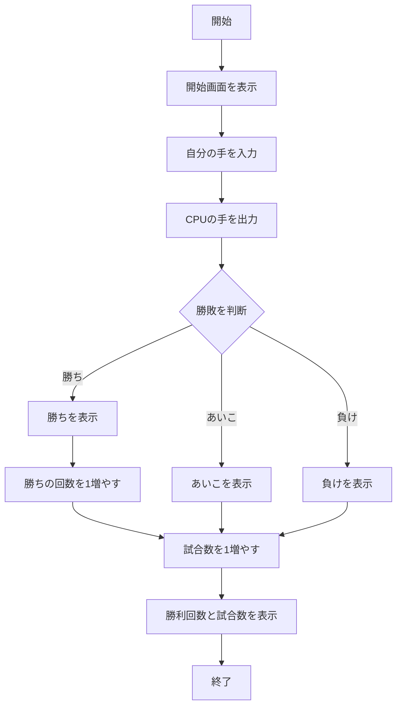

# webpro_06
## このプログラムについて
このプログラムは，じゃんけんのプログラムであり，CPUにランダムに配られる手とクライアントの選択した手の勝敗を判断し，勝ち負けを表示させる．

## ファイル一覧
ファイル名 | 説明
-|-
app5.js | プログラム本体
public/janken.html | じゃんけんの開始画面
viwes/janken.ejs | じゃんけんの表示部分

## 使用方法
1. ターミナルで ```node app5.js``` と打ちプログラムを起動する
1. Webブラウザでlocalhost:8080/public/janken.htmlにアクセスする
1. 自分の手を入力する


