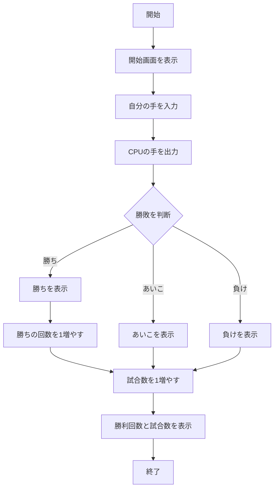
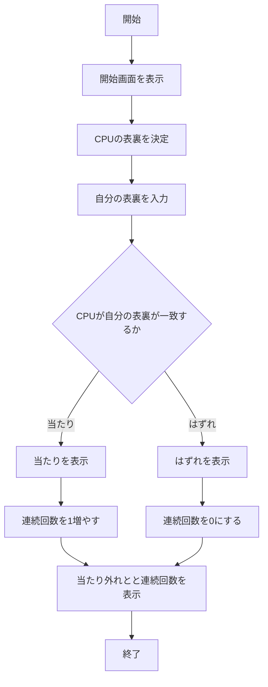
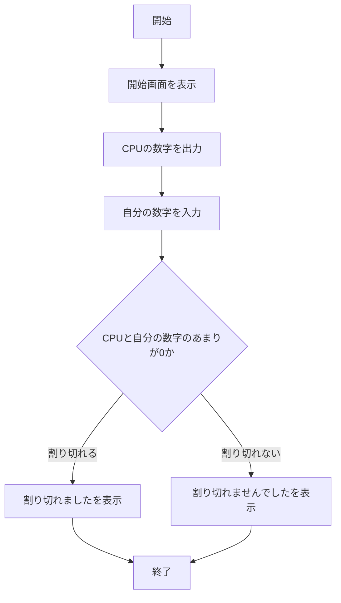

# webpro_06
## このプログラムについて
このプログラムは，じゃんけんのプログラムであり，CPUにランダムに配られる手とクライアントの選択した手の勝敗を判断し，勝ち負けを表示させる．

## ファイル一覧
ファイル名 | 説明
-|-
app5.js | プログラム本体
public/janken.html | じゃんけんの開始画面
viwes/janken.ejs | じゃんけんの表示部分

## 使用方法
1. ターミナルで ```node app5.js``` と打ちプログラムを起動する
1. Webブラウザでlocalhost:8080/public/janken.htmlにアクセスする
1. 自分の手を入力する



# コイントス
## このプログラムについて
このプログラムは，コイントスのプログラムであり，CPUにランダムに配られた表裏と，
選択した表裏が一致するかを判断し，当たりかハズレかを表示させる．．

## ファイル一覧
ファイル名 | 説明
-|-
app5.js | プログラム本体
public/coin.html | コイントスの開始画面
viwes/coin.ejs | コイントスの表示部分

## 使用方法
1. ターミナルで ```node app5.js``` と打ちプログラムを起動する
1. Webブラウザで ```localhost:8080/public/coin.html``` にアクセスする
1. 自分の表裏を入力する



# 割り算
## このプログラムについて
このプログラムは，割り算のプログラムであり，CPUにランダム配られる，
1から100までの数字が，クライアントが入力した数字で割り切れるかを判断して，結果を表示させる．

## ファイル一覧
ファイル名 | 説明
-|-
app5.js | プログラム本体
public/division.html | 割り算の開始画面
viwes/division.ejs | 割り算の表示部分

## 使用方法
1. ターミナルで ```node app5.js``` と打ちプログラムを起動する
1. Webブラウザで ```localhost:8080/public/division.html``` にアクセスする
1. 自分の数字を入力する


